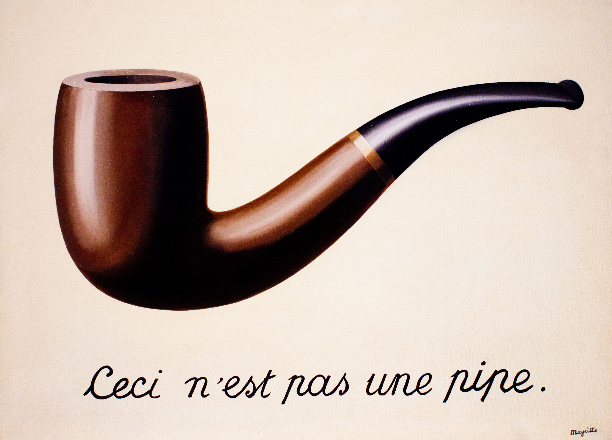

name: main

### .aim[Systems: Ceci n'est pas une pipe.]
<style>
.aim {
font-size: .75em;
border-bottom: 1px solid lightgray;
margin: 1px;
}
.remark-inline-code {
  background-color: lightgray;
  border-radius: 3px;
  padding-left: 2px;
  padding-right: 2px;
}
h4 {
font-size: 1.5em;
margin: 1px;
}
</style>

---
template: main


.center[]

---
template: main

#### Pipe

A conduit in memory between 2 separate processes on the same computer.

--

Pipes have 2 ends, a read end and a write end.

--

Pipes act just like files (i.e. you can read() and write() to send any kind of data).

--

Unnamed pipes have no external identifier.

---
template: main

#### Working with unnamed pipes

`pipe - <unistd.h>`

- Create an unnamed pipe.

- Returns 0 if the pipe was created, -1 if not.

--

- `pipe( descriptors )`

  - `descriptors`
  - Array that will contain the descriptors for each end of the pipe. Must be an `int` array of size 2.

--

  - `descriptors[0]` is the read end.
  - `descriptors[1]` is the write end.

---
template: main

```C
int fds[2];
pipe( fds );
char line[100];
f = fork();
if (f == 0) {
  close( fds[0] );
  write( fds[1], "hello!", 7);
}
else {
  close( fds[1] );
  read( fds[0], line, sizeof(line) );
}
```
