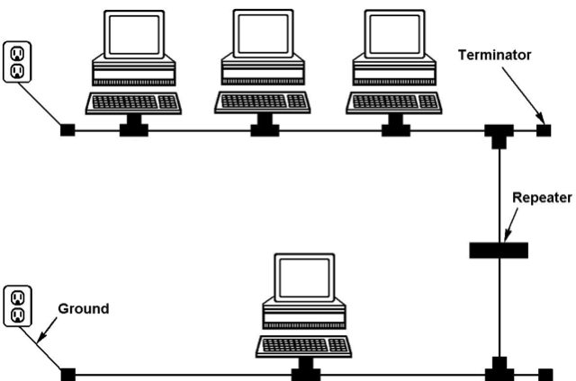
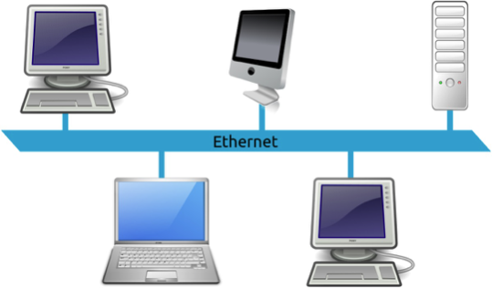

name: main

### .aim[Systems: Cisco in an Hour™]

---
template: main

#### Layer Models of Networking

Due to the complexity of network communications, the topic is often conceptualized into distinct layers so people can work on specific components rather than everything at once.

--

The bottom layer is the most concrete, with each subsequent layer becoming more abstract (relying less on the physical connections and more on code).

--

There are various competing models, including the OSI (Open Systems Interconnections) and TCP/IP Models.

--

TCP/IP Model Layers
1. Application
2. Transport
3. Internet
4. Link

---
template: main

#### Link Layer

Point-to-point transmission between devices on the same (local) network.

--

Combines physically connecting computers with basic addressing and transmission protocols.

--

Physical connection

* How to transmit bits between two computers.

--

* Electrons, photons, radio waves…

---
template: main

#### Link Layer: A brief history of physical connections

__Thicknet__

A single coaxial cable runs along the network.

“Vampire taps” cut into the cable and connect to a computer.

 

---
template: main

__Thinnet__

A single coaxial cable runs along the network.

T-Connectors connect computers to the main cable.

.center[]

---
template: main

__Thin/Thicknet network topology__

.center[]

???
Each new computer degrades the network
collisions could cause issues

---
template: main

__Token Ring__

Each computer is connected in a ring to each other.

Only one computer has command of network resources at a time. This is called "having the token”.

The network sends a "token" throughout the ring, which contains the identity of the computer allowed to use the network. All other computers must wait to send data over the network.

.center[]

???
Each computer provides its own power and keeps single strength constant.

No possibility of collisions

---
template: main

__Ethernet__

Multiple computers connect to a single hub or switch.

Hub: Broadcasts the data to all the computers

Switch: Sends data to a specific computer

.center[]

---
template: main

#### Link Layer: The Softer Side

In order for data to be sent between computers:

--

* Each computer needs a unique address (MAC Address).
* The data needs to be sent in a standardized format (Frames).

--

__MAC (Media Access Control) Address__

* 6 - Byte Hex address: `2a:00:1e:b9:70:f6`
* MAC addresses only need to be unique on the same local network.

---
template: main

#### Link Layer: The Softer Side

__Ethernet Frames__

Each frame has the following format:

<table style="border: solid 1px black">
<thead>
<tr>
<th>prefix</th><th>dest</th>
</tr>
</thead>
</table>

prefix | dest | source | type | data | checksum
--|--|--|--|--
8B  |   6B  |  6B  |  2B |  4B

prefix dest source type data checksum

prefix: 10101010 x7 + 10101011
dest & source: MAC addresses
data: MTU (Maximum Transmission Unit) of 1500B
checksum: ensures data integrity
