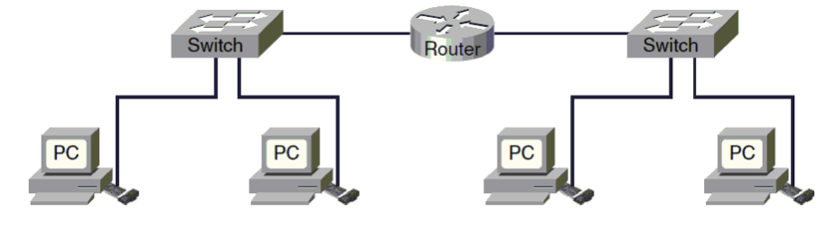

name: main

### .aim[Systems: Cisco in an Hour™ 2: Electric Boogaloo]

---
template: main

---
template: main

#### Link Layer: The Softer Side

In order for data to be sent between computers:

--

* Each computer needs a unique address (MAC Address).
* The data needs to be sent in a standardized format (Frames).

--

__MAC (Media Access Control) Address__

* 6 - Byte Hex address: `2a:00:1e:b9:70:f6`
* MAC addresses only need to be unique on the same local network.

---
template: main

#### Link Layer: The Softer Side

__Ethernet Frames__

Each frame has the following format:

`prefix` `dest` `source` `type` `data` `checksum`

--

`prefix` 8B: `10101010` x7 + `10101011`

`dest` & `source` 6B each: MAC addresses

`type` 2B

`data`: MTU (Maximum Transmission Unit) of 1500B

`checksum` 4B: ensures data integrity

???
<table style="border: solid 1px black">
<thead>
<tr>
<th>prefix</th><th>dest</th>
</tr>
</thead>
</table>

prefix | dest | source | type | data | checksum
--|--|--|--|--
8B  |   6B  |  6B  |  2B |  4B

---
template: main

#### Internet Layer

Transmission of data between two separate networks.

Major features of this layer are addressing and routing.

Routers are physical devices used to connect different local networks.

Internet layer traffic ignores the specifics of link layer traffic.

Inernet Protocol (IP) covers the standards for addressing and packet format.

---
template: main

__Routing__

Routers break IPv4 packets (more later) into fragments.

When a router receives a packet, it has 2 options:

  1. Send that packet to the attached local network.
  2. Forward that packet to a different router.

Routers have address tables that identify all connected networks/devices.

---
template: main

__IP Packets__

IPv4 Packet format:

`header` `source` `destination` `data`

--

`header` 12B: Packet metadata

`source` and `destination` 4B each: IP Address

`data`: MTU is 65,535 Bytes

???
IPv6 uses 8 Byte addresses
IPv6 allows for jumbograms, with an MTU of 4GB

---
template: main

__IPv4 packet header__

`type` `size` `fragment info` `ttl` `protocol` `header checksum`

 

--

`type` 2B: IPv4 / v6, length of header

`size` 2B: Total size of the packet

`fragment info` 4B: full payloads may be broken into multiple fragments. Each packet will count the number of fragments and its individual fragment number.

`ttl` (time-to-live) 1B: Maximum number of hops a packet can make before reaching its destination.

`protocol` 1B: TCP / UDP (this is transport layer information)

`header checksum` 2B: only a checksum of the header, not the full packet.

---
template: main

__IP Addressess__

Every device connected to the internet has an I.P. (Internet Protocol) address.

They might look like this: `149.89.150.100`  (IPv4)

or this: `0:0:0:0:0:ffff:9559:9664` (IPv6)

IP addresses are only needed when connected.

For the most part, organizations own blocks of IP addresses, and give them to their users as needed.

Because IP addresses are released in blocks, internet traffic can be routed in an efficient manner.

---
template: main

__IPv4 / IPv6 differences__

Address space: 2^32 / 2^128

Packet format: In addition to address size change, IPv6 packet headers have less information. They do not include a checksum or fragment information.

MTU:  IPv6 can allot for an MTU of 2^32 (these are called jumbograms)

IPv6 puts more work onto Link layer devices and individual hosts (computers)

IPv6 does not fragment packets at all, relying on other devices to potentially take advantage of jumbograms

IPv6 has no checksum, assuming Link layer devices and hosts will check for data integrity if needed.
